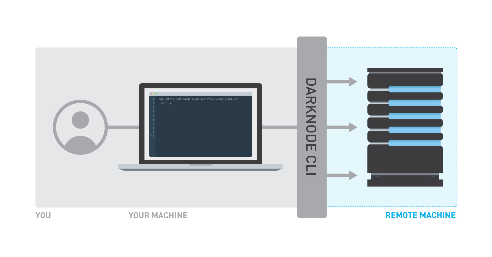

# Darknode CLI

The Darknode CLI is a command-line interface for managing Darknodes on Republic Protocol. It is installed on your local workspace, and will automatically create and update machines for you. Currently it only support **macOS** and **Linux**. 



## Getting Started on AWS

To jump straight into running your first Darknode on AWS, checkout our [Getting Started on AWS](./docs/getting-started-on-aws.md) tutorial.

## Getting Started on Digital Ocean
 
Checkout the instructions for [Creating a Personal Access Token](https://github.com/republicprotocol/darknode-cli#digital-ocean) on Digital Ocean.

## Getting Started on Google Cloud Platform
 
Checkout the instructions for [getting started on GCP](docs/gcp/getting-started-on-gcp.md).


## Installing the tool

To download and install the Darknode CLI, open a terminal and run:

```sh
curl https://releases.republicprotocol.com/darknode-cli/install.sh -sSf | sh
```

This will download the required binaries and templates and install them to the `$HOME/.darknode` directory. Open a new terminal to begin using the Darknode CLI.

## Updating the tool

**Before updating the Darknode-CLI, please make sure you do not have the CLI running in any terminal.**

To update your Darknode CLI, open a terminal and run:

```sh
curl https://releases.republicprotocol.com/darknode-cli/update.sh -sSf | sh
```

This will update your Darknode CLI to the latest version without affecting any of your deployed node. 

## Usage

_Here there be dragons!_

These guidelines are for advanced users. If you just want to see what deploying a Testnet Darknode is like, checkout our [Getting Started on AWS](./docs/getting-started-on-aws.md) tutorial.

### Deploy a Darknode

#### AWS

To deploy a Darknode on AWS, open a terminal and run:

```sh
darknode up --name my-first-darknode --aws --aws-access-key YOUR-AWS-ACCESS-KEY --aws-secret-key YOUR-AWS-SECRET-KEY
``` 

The Darknode CLI will automatically use the credentials available at `$HOME/.aws/credentials` if you do not explicitly set the `--access-key` and `--secret-key` arguments.
By default it will use the credentials of `default` profile,but you can specify which profile you want to use for deployment by:

```sh
darknode up --name my-first-darknode --aws --aws-profile PROFILE-NAME
```

You can also specify the region and instance type you want to use for the Darknode:

```sh
darknode up --name my-first-darknode --aws --aws-access-key YOUR-AWS-ACCESS-KEY --aws-secret-key YOUR-AWS-SECRET-KEY --aws-region eu-west-1 --aws-instance t2.small
``` 
The default instance type is `t3.micro` and region will be random.
You can find all available regions and instance types at [AWS](https://docs.aws.amazon.com/AmazonRDS/latest/UserGuide/Concepts.RegionsAndAvailabilityZones.html).

You can also associate the darknode to an elastic IP by providing the `EIP-ALLOCATION-ID` of the elastic IP. 
Make sure you give the same region of the elastic IP to the darknode. 


```sh
darknode up --name my-first-darknode --aws --aws-access-key YOUR-AWS-ACCESS-KEY --aws-secret-key YOUR-AWS-SECRET-KEY --aws-region SAME-REGION-AS-EIP --aws-elastic-ip EIP-ALLOCATION-ID
``` 

#### Digital Ocean

Follow the steps in the [tutorial](https://www.digitalocean.com/docs/api/create-personal-access-token/) to create a API token. 
To deploy a Darknode on Digital Ocean, open a terminal and run:

```sh
darknode up --name my-first-darknode --do --do-token YOUR-API-TOKEN
``` 

You can also specify the region and droplet size you want to use for the Darknode:

```sh
darknode up --name my-first-darknode --do --do-token YOUR-API-TOKEN --do-region nyc1 --do-droplet 8gb
``` 

The default droplet size is `s-1vcpu-1gb` and region will be random. 
Be aware some region and droplet size are not available to all users.

You can find all available regions and droplet size slug by using the digital ocean [API](https://developers.digitalocean.com/documentation/v2/#regions).

### Destroy a Darknode

_**WARNING: Before destroying a Darknode make sure you have de-registered it, and withdrawn all fees earned! You will not be able to destroy your darknode if it's not fully deregistered. The CLI will guide you to the page where you can deregister your node**_

Destroying a Darknode will turn it off and tear down all resources allocated by the cloud provider. To destroy a Darknode, open a terminal and run:

```sh
darknode destroy my-first-darknode
``` 

To avoid the command-line prompt confirming the destruction, use the `--force` argument: 

```sh
darknode destroy my-first-darknode --force
```

We do not recommend using the `--force` argument unless you are developing custom tools that manage your Darknodes automatically.

### Resize a Darknode 

To resize the instance type your Darknode is using, open a terminal and run:
```sh
darknode resize YOUR-DARKNODE-NAME NEW_INSTANCE_TYPE
```

If you are using AWS, you will need to replace the `NEW_INSTANCE_TYPE` field with the AWS EC2 instance type you wish to use, e.g. `t3.micro` or `t2.medium`."
```sh
darknode resize YOUR-DARKNODE-NAME t3.small
```
You can find all available instance types at [AWS](https://aws.amazon.com/ec2/instance-types).

If you are using DigitalOcean, you will need to replace the `NEW_INSTANCE_TYPE` field with the DigitalOcean droplet slug you wish to use, e.g. `s-1vcpu-2gb` or `s-1vcpu-1gb`.
```sh
darknode resize YOUR-DARKNODE-NAME s-1vcpu-2gb
``` 
This may take longer than AWS as it recreates the instance. You can find all available droplet slugs at [Digital Ocean Standard plans](https://developers.digitalocean.com/documentation/changelog/api-v2/new-size-slugs-for-droplet-plan-changes/) and [DigitalOcean API Slugs](https://slugs.do-api.dev/)

> If you accidentally try to resize to a invalid instance, the darknode will be stopped. You need to run the command again with a valid instance type to restart the darknode. 


### List all Darknodes

The Darknode CLI supports deploying multiple Darknodes. To list all available Darknodes, open a terminal and run:

```sh
darknode list
```

### Stop Darknode

To turn off your darknode, open a terminal and run: 

```sh
darknode stop my-first-darknode

``` 

If it is already off, `stop` will do nothing.

### Start Darknode

To turn on your darknode, open a terminal and run: 

```sh
darknode start my-first-darknode
``` 

If it is already on, `start` will do nothing.

### SSH into Darknode

To access your Darknode using SSH, open a terminal and run:

```sh
darknode ssh my-first-darknode
``` 

### Update a Darknode

To update your Darknode to the latest stable version, open a terminal and run:

```sh
darknode update YOUR-DARKNODE-NAME
``` 

To update the configuration of your darknode, first edit the local version of config, by running:

```sh
nano $HOME/.darknode/darknodes/YOUR-DARKNODE-NAME/config.json
``` 

and now run:

```sh
darknode update my-first-darknode --config
``` 

### Withdraw balance from the Darknode

To withdraw any ETH left in the darknode address, open a terminal and run:

```sh
darknode withdraw YOUR-DARKNODE-NAME --address RECEIVER-ETHEREUM-ADDRESS
``` 

> Note: This will also withdraw any REN in the darknode address. Keep in mind this will only withdraw the ETH and REN the address holds directly, not the rewards it receives by matching orders.
